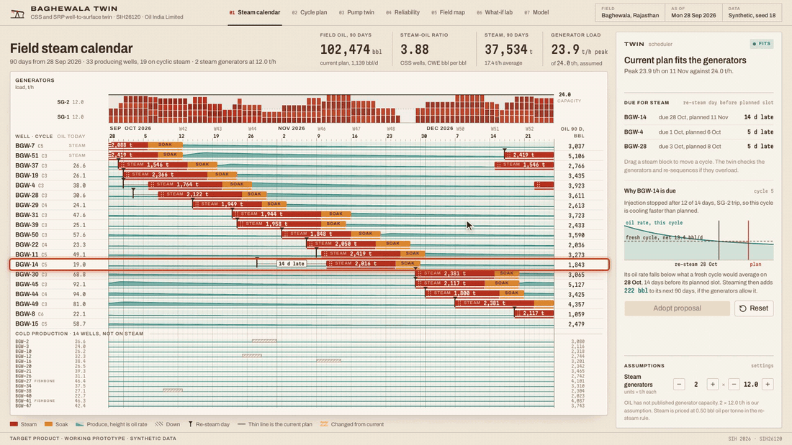

# Thermal Lift Twin, CSS and SRP digital twin

Oil India Limited problem statement. Team 2, Saveetha Engineering College.

Plans the steam cycle day by day, sequences steam across the field's generators,
and runs the pump to the cooling curve, with the cost of a rod failure set against the cost of slowing down.



Status. Target product and working prototype on synthetic data for the field generated
by the same physics the twin runs on. Public field facts are cited in [docs/](docs/honesty.md).
Generator capacity is an assumption and a setting. Not deployed at OIL.

Quick start: `make demo`, then open http://localhost:3000

---

## Screens

The demo follows one well through three screens, and they share one twin, so the edit on the calendar carries into the cycle plan and the pump.

| # | Screen | What it does |
|---|---|---|
| 01 | Steam calendar | 33 wells over 90 days, a generator lane with both units, the current plan under the proposal with changes shaded. Drag a steam slot and the twin checks the generators and re-sequences. |
| 02 | Cycle plan | For one well: the cooling curve, viscosity, oil rate, the day-by-day pump schedule, the rod-float risk band and the steam date. |
| 03 | Pump twin | For the same well: surface and downhole cards from a wave-equation rod model, the rod-float flag, and the VFD in-stroke speed profile. |

Four more screens are built on the same twin but are not in the video and have had less polish: reliability (card drift and an estimated seven-day risk window under stated assumptions), a schematic field map, a what-if lab for one cycle, and the model page with anchors and provenance.

## Run it

Node 22 or later and pnpm 10.

```bash
pnpm install
pnpm dev            # http://localhost:3000
pnpm gen            # rewrite data/demo from the seed
pnpm check          # typecheck, lint, tests, production build
```

The API needs Python 3.11 or later.

```bash
cd apps/api
python3 -m venv .venv && .venv/bin/pip install -r requirements.txt
.venv/bin/pytest -q
.venv/bin/uvicorn twin_api.main:app --port 8000   # http://localhost:8000/docs
```

## Video

`recording/record.ts` plays one flow against a production server and encodes a 1:50 H.264 MP4 at 30 fps.
BGW-14 is dragged to its re-steam day, the generators overload, the twin moves BGW-22, and the take follows BGW-14 into its cycle plan and its pump.
The page renders at 1600 by 900 at 2x and is captured at 1920 by 1080.
The voiceover script with its timings is [recording/voiceover.md](recording/voiceover.md); every number it speaks is on screen when it is spoken.

```bash
pnpm build && pnpm start      # in one terminal
pnpm video                    # writes recording/out/calendar-take.mp4
pnpm voiceover                # rewrites recording/voiceover.md and checks the take's timings
pnpm hero-gif                 # cuts docs/hero.gif from the MP4
pnpm shots                    # hero screenshots
```

## Repository

```
apps/web/            Next.js: calendar, cycle plan, pump twin; reliability, map, what-if and model pages
apps/api/            FastAPI: wells, cycles, telemetry, failures, schedules, generator repair
packages/physics/    thermal decay, viscosity, inflow, rod dynamics, card synthesis, tests against published points
packages/optimise/   re-steam rule, per-well cycle schedule, field steam calendar and repair, failure risk and cost
packages/simulate/   seeded eight-year field history generator built on packages/physics
data/demo/           52 wells, cycles, plan and health as JSON; daily production and SRP telemetry as Parquet
recording/           Playwright take and video scripts, storyboard, voiceover, the MP4 in out/
docs/                model, assumptions (generator capacity), data dictionary, honesty note
```

The web app runs the twin in the browser, so the demo needs no server beyond Next.js.
The API serves the same dataset and schedules on the same oil curves; its tests hold it to the TypeScript scheduler's answer.

## Read next

[Model](docs/model.md) · [Assumptions](docs/assumptions.md) · [Data dictionary](docs/data-dictionary.md) · [Honesty note](docs/honesty.md)

MIT licensed. Fonts are under the SIL Open Font License.
