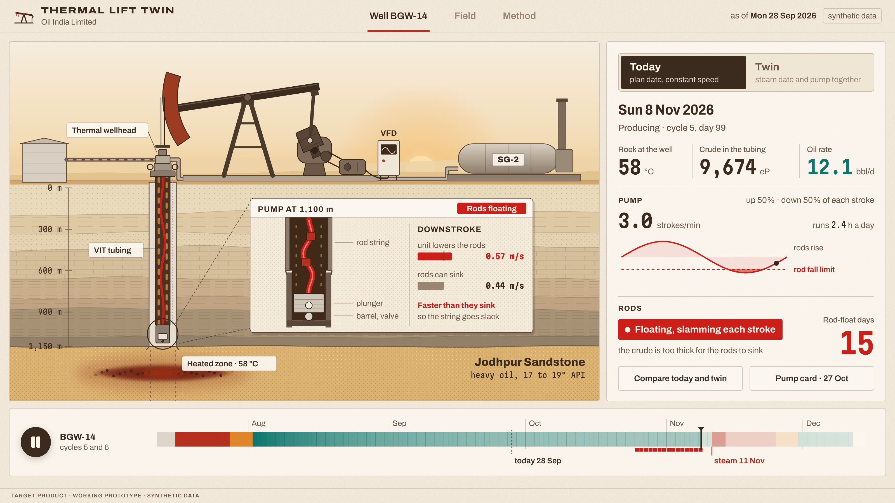

<h1 align="center">Thermal Lift Twin</h1>

<p align="center">Steam cycles and rod pumps, planned together for heavy-oil wells.</p>

<p align="center"></p>

After a steam cycle the rock cools and the crude thickens.
A pump left at constant speed lowers its rods faster than they can sink, so the string goes slack and slams on every stroke.
The twin follows each well's cooling day by day, reshapes every stroke with the drive, fast up and slow down, and books the next steam on the day it pays.

| | Today | With the twin |
|---|---|---|
| Well BGW-14, rod-float days before steam | 17 | 0 |
| Well BGW-14, steam date | 11 Nov | 28 Oct |
| 19 steam wells, rod-float days a year | 250 | 0 |
| 19 steam wells, expected rod and pump failures a year | 4.41 | 2.85 |

Model results on synthetic data built from Oil India's published field figures.
A working prototype, not deployed.

## Run it

```bash
pnpm install
pnpm dev        # http://localhost:3000
pnpm check      # typecheck, lint, tests, build
```

The story is at `/story`, a 3D version at `/story-3d`, and the engineering screens start at `/calendar`.
The field and event names are local display settings in `apps/web/.env.local`, which git ignores.

## Inside

```
apps/web/            Next.js app: the story, the 3D story, seven engineering screens
apps/api/            FastAPI service over the same data and scheduler
packages/physics/    heated-zone cooling, viscosity, inflow, rod dynamics, dyna cards
packages/optimise/   re-steam rule, daily pump schedule, field steam plan, failure risk
packages/simulate/   seeded synthetic field history since 2017
recording/           frame-stepped Playwright takes and the video edit
docs/                model, assumptions, data dictionary, honesty note
```

[Model](docs/model.md) · [Assumptions](docs/assumptions.md) · [Honesty note](docs/honesty.md)

<sub>MIT licensed. Team 2, Saveetha Engineering College.</sub>
